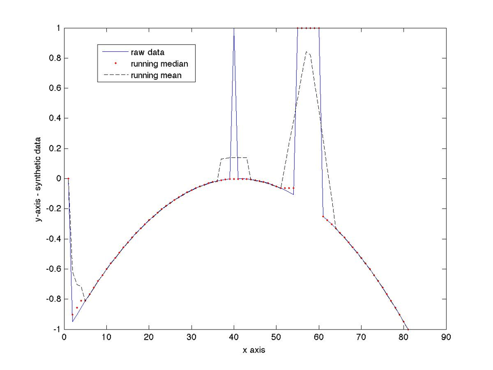

---
jupyter:
  jupytext:
    text_representation:
      extension: .md
      format_name: markdown
      format_version: '1.2'
      jupytext_version: 1.5.1-dev
---


# Review - Procedural Abstraction

## Writing and Using Functions

Today’s Class:
* Midterms
* Quiz
* More practice with functions, loops and if, logical indexing

## Midterm Results

(results go here)

## Lab 8 Stuff…

* A function doesn’t have to have output arguments (e.g. ```checkinputs```)
* Variables in a subfunction are local to that subfunction: i.e. they need to be declared inside the subfunction or passed in through the input argument list
Error messages – “drill up/down” set of messages help you track where the problem is occurring, especially if in a subfunction or function

## Logical Indexing

Recall:  mentioned during
* week 03
* when logical operators covered
  
Review:

```matlab
x=10*rand(1000,1);
% pick out only values > 5
y2=x(x>5);
% could also have used “find”, but logical indexing is much faster
ix=find(x>5);
y2=x(ix);
```

## Assignment 2: Global Warming Data Sets

Science: the rise of temperature and CO2

Data analysis / matlab:  running mean, median, standard deviation


