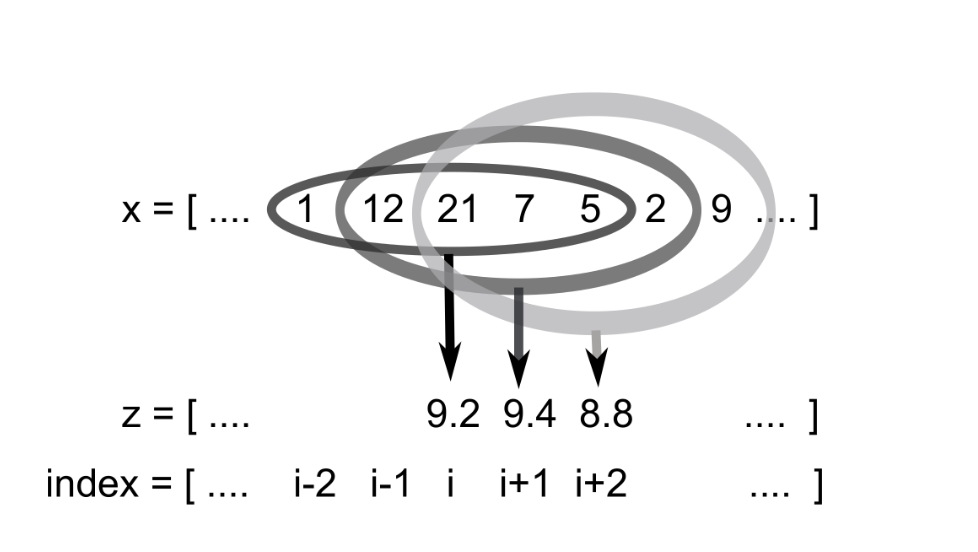

---
jupyter:
  jupytext:
    formats: ipynb,md
    text_representation:
      extension: .md
      format_name: markdown
      format_version: '1.3'
      jupytext_version: 1.11.2
  kernelspec:
    display_name: Python 3
    language: python
    name: python3
---

<!-- #region -->
# Lab Week 6

## EOSC 211

### Learning Objectives:

1. develop algorithms involving loops.
2. carry out a top-down design process.
3. modularize code, separating the algorithm from input/output statements.
4. solve a problem useful in the earth sciences

### Themes

loops

top down design

testing code/writing code that passes tests -- how to do without functions??

doing the math -- running mean/median equations


### Intro

In the very first lab you plotted a long sequence (a TIME SERIES) of temperatures at Sand Heads.  Remember that the data showed a broad seasonal trend (colder in winter, warmer in summer), but that at veryshort time scales (a day or two) there was a great deal of variability which gave the curve a fuzzy lookwhen you plotted a whole year.  It is often very useful to be able to “SMOOTH” a time series to betterdisplay broad trends by averaging away the short-time variability. A very simple way of smoothing a time series is to use a so-called RUNNING MEAN. Imagine thatNdata points are recorded hourly, and number them 1,2,3,. . .,i−1, i, i+ 1,. . .,Nas they appear in a vector.If we are calculating a 5 point running mean, then the 5th point in the SMOOTHED time series will bethe average of points 3, 4, 5, 6 and 7 from the original time series (from “two-to-the-left” to “two-to-the-right”).  The 6th point in the smoothed time series will be the average of points 4, 5, 6, 7,and 8 from theoriginal time series. The 7th point will be the average of points 5, 6, 7, 8, and 9. And so on, moving overone point each time, with your window RUNNING through the time series, calculating the average of thepoints in the window at each point in the original series (Fig. 2).


<p style="text-align: center;">Fig 2: An example of the 5 point running mean. The $i$th element of $z$ will be 9.2, an average of 1, 12, 21, 7, and 5. The next element will be 9.4, an average of 12, 21, 7, 5, and 2, and so on.</p>


How de we describe this mathematically? Formally, we start with a time series vector $x$, whose $i$th element is $x_i$ where $i= 1. . . N$.  Then we form a new time series $z$, again with $N$ elements, for which the $$ith point $z_i$ is an average of points in $x$ within the window. If the window has a length of 5, then:

$$
z_i = \frac{x_{i-2} + x_{i-1} + x_{i} + x_{i+1} + x_{i+2}}{5}
$$

$$
z_i = \frac{1}{5}\sum_{k=-2}^2 x_{i+k}
$$

and if it has a length $L$(which has to be an odd number) then it would be:

$$
z_i = \frac{1}{L}\sum_{k=-W}^Wx_{i+k} 
$$
where
$$
W = \frac{L-1}{2}
$$

In MATLAB you can write x(i)and z(i) as code elements corresponding to xi and zi,x for x, etc.,because MATLAB was designed to translate math into code! Now, we don’t just program the long sum of 5 points in eqn. (1), because we may want to change the length of the window - we want L as another input parameter. This is because we might want a 3 point running mean, or a 9 point running mean. Instead, in this lab, you will use loops to program eqn. (3). To write the required code, we will break the problem down into a series of steps, which you will follow as you go through the lab:

•First, develop a basic algorithm, looping through all the points in a time series of arbitrary length setting xi=`<something>`.

•Then, develop the code that computes the running mean inside that basic loop, so that xi=`<runningmean centered at pointi >`.

•Next, add some if-statements to handle the awkward cases that take place at the start and end of theloop.

•Finally, copy/modify that code to handle a closely related (but different) task (the running median).

Hint:  it is good practice to write the code so that algorithm inputs and outputs are clearly defined using specific variable names.
<!-- #endregion -->

```python
from e211_lib import e211
from matplotlib import pyplot as plt
```

```python
vel, time = e211.load_aircraft("aircraft_gps.mat")
vel, time
```
