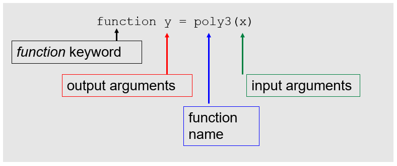

---
jupyter:
  jupytext:
    text_representation:
      extension: .md
      format_name: markdown
      format_version: '1.2'
      jupytext_version: 1.5.1-dev
---

# W8D1: Procedural Abstraction

## Writing and Using functions

Reading:
>Text book p. 101-113, 193-207, 341-346

I will provide minimal additional notes

## Concepts for Today’s Class:

* Defining functions
* Using a function
* Calling a function, returning from a function, help
* Pass-by-value versus pass-by-reference
* scope & sub-functions

**Lab:** Writing a Function <br>
**Assignment:** Part 2 due Wed. Nov 7th, 4pm.

## Function Definition Line



function y = poly3(x)
function name
input arguments
output arguments
function [volsum, gvadep]=getvol(mlong,mlatg,deg2km,mthick,mask)
Can have more than one input argument and/or output argument, e.g.
Matching the order of multiple input/output arguments is critical when calling the function from the main script
function keyword

```


# Slide 2
```

H1 Lines and Help
function y = poly3(x)
%
% Evaluates a cubic polynomial y = a*x + b*x^2 + c*x^3
% where a=1, b=-1, c=2
%
% Input:    x
% Output:   y = a*x + b*x^2 + c*x^3
%
a = 1;
etc
The H1 Lines are the comment block immediately after function definition line, before first line of the code.  

They should explain what the function does, the input and output arguments and any checks that are performed.

They appear in the command window when you type e.g.,
>> help poly3

```


# Slide 3
```

Function Body
function y = poly3(x)
%
% Evaluates a cubic polynomial y = a*x + b*x^2 + c*x^3
% where a=1, b=-1, c=2
%
% Input:    x
% Output:   y = a*x + b*x^2 + c*x^3
%
a = 1;
b = -1;
c = 2;
y = a*x + b*x^2 + c*x^3;⁣
end
a, b, c, x, y are local variables

```


# Slide 4
```

Worksheet 1
Exercise 1

```


# Slide 5
```

Function Call from Main Script
t=12;
a = poly3(t)
Note that the variables in the main script can have either the same (mthick, mask) OR different (e.g., vol1, dep1, lon, lat,d2km) names from inside the function.  This brings us to the topic of how arguments are passed from the script to a function….

```


# Slide 6
```

Worksheet 1
Exercise 2

```


# Slide 7
```

Returning from a Function
A function returns control to the main script when the first of the following occur:
The end of the code is reached
The word “return” is reached
The word “error” is reached

```


# Slide 8
```

Worksheet 1
Exercise 3

```


# Slide 9
```

Subfunctions
Subfunctions are a method to further simplify your code
They are limited in scope i.e. can only be called by the parent function (main function) that contains them
function fancyprint(Str)
%
% Print the string Str with * at the beginning and end of
% the string.
%
WrappedStr = wrapstr(Str);
disp(WrappedStr);
function Newstr = wrapstr(Str)
Newstr(1) = '*';
Newstr(2:length(Str)+1) = Str;
Newstr(end+1) = '*';

```


# Slide 10
```

Worksheet 1
Exercises 4, 5 and 6

```


# Slide 11
```

Logical Indexing:  
Prep for worksheet 2 on Thurs
Recall:  mentioned during
- week 03
- when logical operators covered
- when “find” covered
Review:
x=10*rand(1000,1);
% pick out only values > 5
y2=x(x>5);
% could also have used “find”, but logical indexing is much faster
ix=find(x>5);
y2=x(ix);

```

