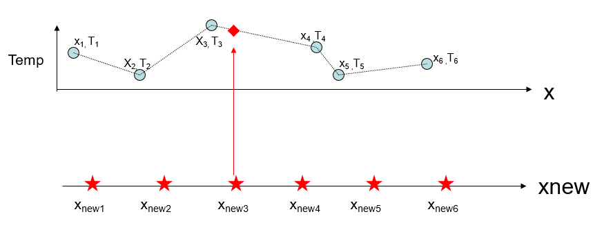

---
jupyter:
  jupytext:
    text_representation:
      extension: .md
      format_name: markdown
      format_version: '1.2'
      jupytext_version: 1.5.1-dev
---


# Week 11

## Day 1: Interpolation

### Week 11:  What and When

* **Today (Tues):** code / background for this week’s lab:  Interpolating data sets.
* **Thurs:** background and worksheet for assignment 2.  I will post assignment 2 on Tuesday.  It is due Wednesday November 28, 4pm.
* No new MATLAB this week with exception of using built-in interpolation functions.  Lots of review / practice.
* This week (week 11) is the last week with a lab that must be turned in.  During weeks 12 and 13 you can use the lab times to work on assignment 2.  There will be TAs in the lab but no additional TA hours those weeks.

## Common problems in data analysis


This requires estimating data at locations or times where we don’t have a measurement.

Same underlying issue: want to fill in the gaps or re-grid onto an even sampling interval!
One way to handle this is BINNING your data and then taking the mean / median / mode in each bin.
This is not always practical since don’t always have many repeat or nearby measurements

### Some Definitions

> **Interpolation:**
> Estimating data between some known measurement points. Done all the time, care needed
>
> **Extrapolation:**
> Estimating data beyond the end of your measurement set.
> This is VERY dangerous, and should be avoided

### Why interpolate or re-grid data?

* Comparing / overlaying multiple data sets (maps especially)
* Create evenly spaced data so we can use our running-mean code for example
* If we have lots of observations in one time interval and few in another any statistics will be biased toward the time period w/ more observations - want evenly gridded data
* Doing spectral analysis (fourier transforms etc)


How to do this?  

The first thing is to define a new, evenly spaced x-axis:

Next, we want to estimate our quantity of interest, y, (e.g. temperature) at our new points, ```xnew```.

There are many ways to do this...

## Nearest Neighbour Interpolation

Let’s say our original measurements are temperature, ```T```, versus distance, ```x```


We could estimate the temperature at each of our new points, ```xnew(j)``` by assigning
The value of temp at the nearest point ```x(i)``` in the original time series,
e.g., ```x3``` is closest to ```xnew3```, so we could put ```Temperature(xnew3) = T3```

> **Name:** Nearest neighbor interpolation
>
> **Advantage:** Fast
>
> **Disadvantage:** Produces a “step-like” function, i.e., discontinuous ```Temp```

## Linear Interpolation



We could average the values of temperature at the two points ```x3``` and ```x4```

Not so great, but...

We could add a percentage of the difference ```T4-T3``` to the value ```T3```, and the ```%``` would be based on the fractional distance xnew3 is toward ```x4``` from ```x3```

> **Name:**	Linear interpolation
>
> **Advantage:** * Still pretty fast, produces continuous function
>
> **Disadvantage:** “Corners” at data points, discontinuous first derivative

## Cubic Splines


We might want our estimates to be more smoothly varying and fit a polynomial.
A better version of this approach involves the use of functions called splines.

> **Name:** Cubic splines
>
> **Advantage:** Smooth function, continuous second derivative
>
> **Disadvantage:** Slower (not big deal), can produce “overshoots” in large data gaps
