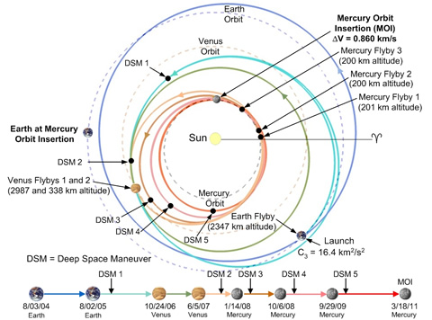
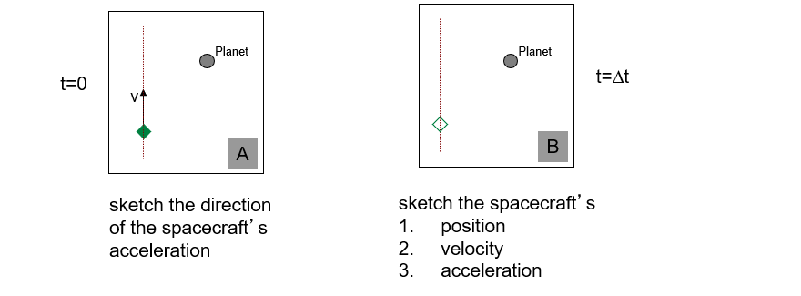
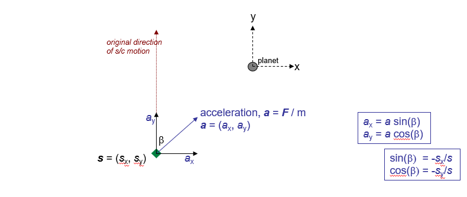
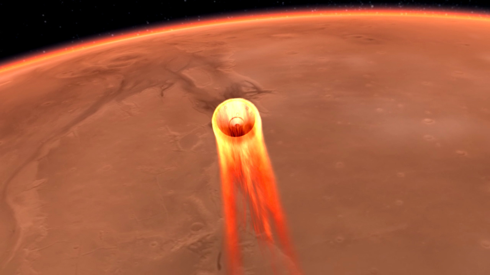

---
jupyter:
  jupytext:
    text_representation:
      extension: .md
      format_name: markdown
      format_version: '1.2'
      jupytext_version: 1.5.1-dev
---

# Numerical Integration

## Spacecraft Flybys of Planets

**Concept:** Use of planetary flybys to modify spacecraft trajectories

A color composite image of Earth 9/22/17 taken by the MapCam camera on NASA’s OSIRIS-REx spacecraft. This image was taken just hours after the spacecraft completed its Earth Gravity Assist at a range of approximately 106,000 miles (170,000 kilometers).
Visible in this image are the Pacific Ocean and several familiar landmasses, including Australia in the lower left, and Baja California and the southwestern United States in the upper right.

The dark vertical streaks at the top of the image are caused by short exposure times (less than three milliseconds). Short exposure times are required for imaging an object as bright as Earth, but are not anticipated for an object as dark as the asteroid Bennu, which the camera was designed to image.


> **Physics needed:** Newton’s laws (gravitation & motion), resolving vectors
> **MATLAB:** Use skills from this class! Learn basics of numerical integration

## Real Planetary Flybys



Animations - MESSENGER Mission Website:

[Gravity Assist Simulator](http://btc.montana.edu/messenger/Interactives/ANIMATIONS/grav_assist/gravity_assist.html "grav assist")

[Notes on gravitational assist](http://www.planetary.org/blogs/guest-blogs/2013/20130926-gravity-assist.html)

What happens to the spacecraft speed and direction depends on how close it flies to the planet and the relative motion of the s/c and planet

## From the planet’s perspective

planet is stationary, spacecraft moves relative to the planet
e.g. our assignment!!


## Boosting a spacecraft’s speed

e.g. Getting to the outer solar system using Jupiter

e.g. New Horizons, Voyager missions...


## Slowing a spacecraft’s speed

e.g. Getting into orbit around a planet in the inner solar system

e.g. MESSENGER mission to Mercury


## Assignment 2

* Mimic the flybys of Mercury by the MESSENGER spacecraft
* Spacecraft starts out distant from Mercury, with speed 7 km/s
* Flies to within ~200 km of surface in our assignment (was to within 201 km of surface in actual flybys).

```{note}
$7 km/s = 3600*7 km/hr$, so over $25,000 km/hr$!
```


### The Assignment

Given
* The initial $(t=0)$ spacecraft velocity vector
* The initial $(t=0)$ spacecraft position vector
* Time increment at which to calculate positions
> Calculate the entire spacecraft trajectory until a time $t = t_{final}$


### How to do this

Spacecraft is moving with initial velocity, $v$ in the direction shown.  It is at some known position relative to the center of the planet. In the absence of the planet assume there are no other forces on the spacecraft (e.g., no rocket burns, no drag etc).


Spacecraft is moving with initial velocity, $v$ in the direction shown ($v$ has two components, $(v_x, v_y)$).  It is at some known position relative to the center of the planet $(x,y)$.
The sketches below describe the instantaneous directions of force, acceleration and velocity experienced by the spacecraft:




### How to calculate the acceleration of the spacecraft



Direction of $F, a$ (due to the planet) is shown in blue.

**Newton's Law of Gravitation:**

```{math}
F = \frac{G M_p m}{s^2}
```

where $M_p$ is the mass of the planet, $m$ = mass of spacecraft, $s$ is distance between them

**Newton's Second Law of Motion:**

```{math}
a = F / m = \frac{GM_p}{s^2}
```
$a$ is the acceleration of the satellite. Use a coordinate system with origin at the planet’s center with $x$ and $y$ directions shown.
The acceleration can be resolved into two perpendicular components, $a_x$ and $a_y$.

### Calculating the spacecraft trajectory

**Resolve the acceleration into two components:**

```{math}
a = (a_x, a_y)
```

After a time $\Delta t$, $a_x$ and $a_y$ have changed the $x$ and $y$ components of the velocity resulting in a new speed and new direction of motion. They also change the $x$ and $y$ components of position, resulting in a new spacecraft position. Repeat the calculation with the new values $x, y, v_x, v_y$

## Results


## Unrelated to flybys but also planetary…

[InSight Landing – Nov 26, 2018 = MONDAY Week 13, Noon PST.](https://mars.nasa.gov/insight/timeline/landing/watch-online/)

Stop by to ‘watch’ in the Pacific Museum of Earth, EOS Main Lobby

11:00 am – 1:00 pm, 11/26/2018




